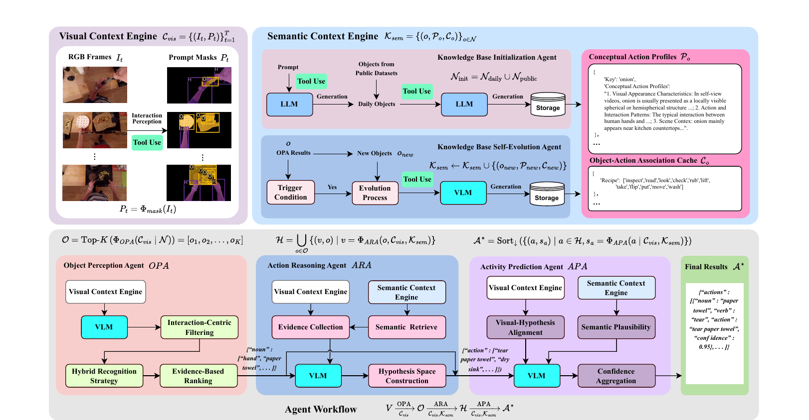
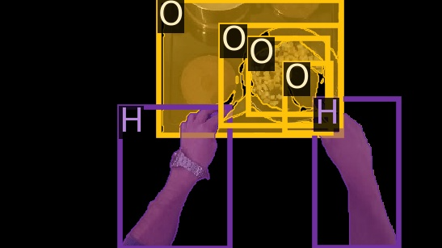

<div align="center">

# EgoDirector

### Self-Evolving Semantic Context Adaptation for Scalable Open-World Egocentric Activity Recognition

*Under review at IEEE Transactions on Circuits and Systems for Video Technology (TCSVT)*

Baolong Liu, Guolong Xu, Zihao Wang, Tingting Guo, Yan Tian, Jianfeng Dong, Xi-Ao Ma, Chuanhuang Li


[🌐 Project Page](https://1781950192.github.io/EgoDirector/) · [📄 Paper](#-citation) · [🖥️ Code](https://github.com/1781950192/EgoDirector)

</div>

<p align="center">
  
</p>

<p align="center">
  <em>EgoDirector is a tuning-free agentic framework that decomposes open-world egocentric activity recognition into
  coordinated perception, reasoning and prediction, powered by a <b>Visual Context Engine (VCE)</b> and a
  <b>Self-Evolving Semantic Context Engine (SCE)</b>.</em>
</p>

---

> 📌 **Status:** This repository is the reference implementation of a manuscript **currently under review** at
> *IEEE Transactions on Circuits and Systems for Video Technology*. The paper is not yet published; results reported
> below correspond to the submitted version and may change after revision.

## 🔥 News

- **[2026.10]** Code, prompts and the self-evolving knowledge base are released.
- **[2026.10]** Efficiency and real-time inference benchmarks are released.

---

## 📖 Overview

Open-world egocentric action recognition is hindered by severe **perceptual uncertainty** (camera motion, motion blur,
hand-object occlusion) and the **combinatorial explosion** of unseen action–object pairs. Supervised models and
static neuro-symbolic knowledge bases both suffer from *knowledge stagnation*: once deployed, their knowledge cannot
adapt to novel concepts.

**EgoDirector** reformulates action recognition as collaborative reasoning among specialized agents and keeps adapting
at inference time — **without any training or fine-tuning on the target domain** (strictly tuning-free).

The whole recognition process is a progressive knowledge-guided decomposition:

$$
V \;\xrightarrow[\;\mathcal{C}_{vis}\;]{OPA}\; \mathcal{O}
  \;\xrightarrow[\;\mathcal{C}_{vis},\,\mathcal{K}_{sem}\;]{ARA}\; \mathcal{H}
  \;\xrightarrow[\;\mathcal{C}_{vis},\,\mathcal{K}_{sem}\;]{APA}\; \mathcal{A}^{*}
$$

where $\mathcal{O}$ is the set of detected interactive objects, $\mathcal{H}$ the structured hypothesis space of
plausible action–object pairs, and $\mathcal{A}^{*}$ the final ranked activity list with confidence scores.

---

## 🧠 Method

<table>
<tr><th width="22%">Component</th><th>Description</th></tr>
<tr>
<td><b>Visual Context Engine</b><br>(VCE)</td>
<td>Builds a dual-source visual context $\mathcal{C}_{vis}=\{(I_t, P_t)\}_{t=1}^{T}$: raw RGB frames paired with
hand-object <b>prompt masks</b> $P_t=\Phi_{mask}(I_t)$ produced by <a href="https://github.com/epic-kitchens/VISOR-HOS">VISOR-HOS</a>.
Background noise is filtered out and hands/objects are explicitly labelled (<code>H</code>/<code>O</code>), which
mitigates perceptual uncertainty at a low token cost.</td>
</tr>
<tr>
<td><b>Self-Evolving<br>Semantic Context Engine</b><br>(SCE)</td>
<td>Maintains a dynamic knowledge base $\mathcal{K}_{sem}=\{(o,\mathcal{P}_o,\mathcal{C}_o)\}_{o\in\mathcal{N}}$.
Each concept stores a <b>Conceptual Action Profile</b> $\mathcal{P}_o=\{D_{vis}, D_{act}, D_{sce}\}$ and a lightweight
<b>Object–Action Association Cache</b> $\mathcal{C}_o=\{v_1,\dots,v_k\}$. Triggered by novel objects during inference,
the engine evolves $\mathcal{K}_{sem}\leftarrow\mathcal{K}_{sem}\cup\{(o_{new},\mathcal{P}_{new},\mathcal{C}_{new})\}$,
enabling lifelong adaptation on the fly.</td>
</tr>
<tr>
<td><b>OPA</b><br>Object Perception Agent</td>
<td>Extracts a ranked object set $\mathcal{O}=\mathrm{Top\text{-}K}(\Phi_{OPA}(\mathcal{C}_{vis}\,|\,\mathcal{N}))$ via
interaction-centric filtering, hybrid recognition and evidence-based ranking.</td>
</tr>
<tr>
<td><b>ARA</b><br>Action Reasoning Agent</td>
<td>For every detected object, infers the most plausible verb from visual evidence plus retrieved semantic priors,
forming $\mathcal{H}=\bigcup_{o\in\mathcal{O}}\{(v,o)\,|\,v=\Phi_{ARA}(o,\mathcal{C}_{vis},\mathcal{K}_{sem})\}$.</td>
</tr>
<tr>
<td><b>APA</b><br>Activity Prediction Agent</td>
<td>Referees the final decision by scoring each hypothesis on <i>visual–hypothesis alignment</i>,
<i>semantic plausibility</i> and <i>confidence aggregation</i>, then outputs
$\mathcal{A}^{*}=\mathrm{Sort}_{\downarrow}(\{(a,s_a)\})$ as a strictly formatted JSON array.</td>
</tr>
</table>

<p align="center">
  <br>
  <em>Prompt mask produced by the Visual Context Engine: hands (<code>H</code>) and manipulated objects
  (<code>O</code>) are explicitly labelled, while background regions are suppressed.</em>
</p>

### Benchmarking openness levels

| Level | Meaning |
|:-----:|---------|
| **L1** | Closed-set: all atomic concepts and compositions seen during training. |
| **L2** | Partially open: unseen composite concepts, seen atomic concepts. |
| **L3** | **Fully open-world**: both atomic concepts and compositions are unknown at deployment time. |

Metrics: **Object / Action / Activity** accuracy, **WUPS** (semantic similarity), and **Phrase** accuracy (strict
action–object matching).

---

## 📊 Results

### Comparison with state of the art

> EgoDirector is evaluated under the **strict L3** fully open-world setting, while all baselines are reported under
> the **easier L1** setting. Numbers are verbal/noun/action accuracy (%) and WUPS / strict phrase accuracy.

<table>
<tr><th rowspan="2">Method</th><th rowspan="2">Publication</th><th colspan="5">GTEA Gaze</th><th colspan="5">GTEA Gaze+</th><th colspan="5">EPIC-KITCHENS-100</th></tr>
<tr><th>Obj</th><th>Act</th><th>Acty</th><th>WUPS</th><th>Phrase</th><th>Obj</th><th>Act</th><th>Acty</th><th>WUPS</th><th>Phrase</th><th>Obj</th><th>Act</th><th>Acty</th><th>WUPS</th><th>Phrase</th></tr>
<tr><td>KGL</td><td>PRL 2022</td><td>5.12</td><td>8.04</td><td>6.58</td><td>35.83</td><td>0.30</td><td>14.78</td><td>6.73</td><td>10.87</td><td>39.41</td><td>1.10</td><td>3.89</td><td>2.56</td><td>3.23</td><td>36.85</td><td>0.94</td></tr>
<tr><td>EgoVLP-Decomp</td><td>NeurIPS 2022</td><td>10.17</td><td>8.45</td><td>9.31</td><td>40.51</td><td>0.90</td><td>29.43</td><td>17.17</td><td>23.30</td><td>51.74</td><td>4.10</td><td>19.51</td><td>10.77</td><td>15.14</td><td>40.51</td><td>0.90</td></tr>
<tr><td>LaViLa-Decomp</td><td>CVPR 2023</td><td>6.07</td><td>23.07</td><td>14.57</td><td>48.65</td><td>2.10</td><td>28.27</td><td>25.47</td><td>26.87</td><td>53.12</td><td>7.89</td><td>23.25</td><td>11.16</td><td>17.21</td><td>43.37</td><td>4.28</td></tr>
<tr><td>ALGO</td><td>ECCV 2024</td><td>13.07</td><td>17.05</td><td>15.05</td><td>46.89</td><td>1.80</td><td>26.23</td><td>11.44</td><td>18.84</td><td>43.29</td><td>3.40</td><td>6.76</td><td>10.21</td><td>8.48</td><td>38.53</td><td>1.72</td></tr>
<tr><td>ALGO + LaViLa</td><td>ECCV 2024</td><td>17.50</td><td>26.60</td><td>22.05</td><td>49.42</td><td>3.50</td><td>30.74</td><td>27.00</td><td>28.87</td><td>53.38</td><td>8.30</td><td>22.84</td><td>12.54</td><td>17.69</td><td>34.47</td><td>4.39</td></tr>
<tr><td>EgoVLP + ProbRes</td><td>ICCV 2025</td><td>–</td><td>–</td><td>19.12</td><td>49.25</td><td>1.97</td><td>–</td><td>–</td><td>29.84</td><td>53.98</td><td>6.32</td><td>–</td><td>–</td><td>13.45</td><td>40.53</td><td>2.36</td></tr>
<tr><td>LaViLa + ProbRes</td><td>ICCV 2025</td><td>–</td><td>–</td><td>33.80</td><td>53.34</td><td>8.98</td><td>–</td><td>–</td><td>31.70</td><td>53.82</td><td>9.33</td><td>–</td><td>–</td><td>18.89</td><td>43.55</td><td>4.61</td></tr>
<tr><td><b>EgoDirector (Ours)</b></td><td>–</td><td><b>27.27</b></td><td><b>55.11</b></td><td><b>41.19</b></td><td><b>64.94</b></td><td><b>14.96</b></td><td><b>33.32</b></td><td><b>49.79</b></td><td><b>41.56</b></td><td><b>58.93</b></td><td><b>23.45</b></td><td><b>30.12</b></td><td><b>38.75</b></td><td><b>34.44</b></td><td><b>55.61</b></td><td><b>16.40</b></td></tr>
</table>

With a single lightweight **8B open-source VLM**, EgoDirector achieves an average **139% relative improvement** over
prior methods under the L3 setting (e.g. strict phrase accuracy on GTEA Gaze+: **23.45** vs. 9.33).

### Ablation on the key components

<table>
<tr><th rowspan="2">Configuration</th><th colspan="5">GTEA Gaze</th><th colspan="5">GTEA Gaze+</th><th colspan="5">EPIC-KITCHENS-100</th></tr>
<tr><th>Obj</th><th>Act</th><th>Acty</th><th>WUPS</th><th>Phrase</th><th>Obj</th><th>Act</th><th>Acty</th><th>WUPS</th><th>Phrase</th><th>Obj</th><th>Act</th><th>Acty</th><th>WUPS</th><th>Phrase</th></tr>
<tr><td>LaViLa + ProbRes</td><td>–</td><td>–</td><td>33.80</td><td>53.34</td><td>8.98</td><td>–</td><td>–</td><td>31.70</td><td>53.82</td><td>9.33</td><td>–</td><td>–</td><td>18.89</td><td>43.55</td><td>4.61</td></tr>
<tr><td>Agent Workflow</td><td>18.37</td><td>8.14</td><td>13.26</td><td>49.72</td><td>3.03</td><td>32.07</td><td>12.40</td><td>22.24</td><td>52.47</td><td>6.25</td><td>28.81</td><td>10.61</td><td>19.71</td><td>50.23</td><td>4.06</td></tr>
<tr><td>+ Visual Context Engine (VCE)</td><td>20.64</td><td>19.89</td><td>20.27</td><td>52.09</td><td>6.25</td><td>32.51</td><td>18.15</td><td>25.33</td><td>52.49</td><td>8.36</td><td>29.19</td><td>16.54</td><td>22.87</td><td>50.58</td><td>6.28</td></tr>
<tr><td>+ VCE + Semantic Context Engine (SCE)</td><td><b>27.27</b></td><td><b>55.11</b></td><td><b>41.19</b></td><td><b>64.94</b></td><td><b>14.96</b></td><td><b>33.32</b></td><td><b>49.79</b></td><td><b>41.56</b></td><td><b>58.93</b></td><td><b>23.45</b></td><td><b>30.12</b></td><td><b>38.75</b></td><td><b>34.44</b></td><td><b>55.61</b></td><td><b>16.40</b></td></tr>
</table>

### Model-agnostic scalability (GTEA Gaze+, L3)

<table>
<tr><th>Backbone</th><th>Obj</th><th>Act</th><th>Acty</th><th>WUPS</th><th>Phrase</th></tr>
<tr><td>minicpm-v-4.6</td><td>25.90</td><td>38.42</td><td>32.16</td><td>47.76</td><td>15.85</td></tr>
<tr><td>internVL-3.5-8B</td><td>33.72</td><td>45.62</td><td>39.66</td><td>51.93</td><td>21.48</td></tr>
<tr><td>Gemma3-12B-it</td><td>17.25</td><td>29.13</td><td>23.19</td><td>44.39</td><td>9.55</td></tr>
<tr><td>Qwen3-VL-8B-Instruct <em>(default)</em></td><td>33.32</td><td>49.79</td><td>41.56</td><td>58.93</td><td>23.45</td></tr>
<tr><td>Qwen3-VL-32B-Instruct</td><td><b>35.45</b></td><td><b>51.53</b></td><td><b>43.49</b></td><td><b>59.72</b></td><td><b>24.67</b></td></tr>
</table>

### Real-time factor

<table>
<tr><th>Dataset</th><th>Total inference (s)</th><th>Video length (s)</th><th>RTF ↓</th></tr>
<tr><td>GTEA Gaze</td><td>6.522</td><td>6.303</td><td>1.034</td></tr>
<tr><td>GTEA Gaze+</td><td>5.204</td><td>3.185</td><td>1.640</td></tr>
<tr><td>EPIC-KITCHENS-100</td><td>4.154</td><td>3.259</td><td>1.390</td></tr>
</table>

---

## 📁 Repository Structure

```
EgoDirector/
├── main_gtea.py              # Entry point: GTEA Gaze
├── main_egtea.py             # Entry point: GTEA Gaze+
├── main_ek100.py             # Entry point: EPIC-KITCHENS-100
├── action_pipeline.py        # OPA / ARA / APA agent implementations
├── pipeline.py               # Frame extraction, subsampling, result writing
├── context_manager.py        # SCE knowledge-base I/O and context-base overlay
├── dataset_adapters.py       # GTEA / GTEA+ / EK100 data adapters
├── vllm_client.py            # OpenAI-compatible vLLM client
├── prompts.py                # Prompt construction for every agent
├── utils.py                  # Shared utilities
├── moduls.py                 # Legacy single-script reference implementation
├── prompt/                   # Prompt templates (noun selection, action selection, ...)
├── context/                  # Self-evolving knowledge base (JSON)
├── context_base/             # Base knowledge used to initialise `context/`
├── {gtea,egtea,ek100}_process/  # Accuracy / WUPS evaluation (trans.py, trans_wups.py)
├── efficiency/               # Inference-time breakdown + real-time benchmarks
├── web_app.py                # Flask visualisation server
├── web/                      # Front-end (templates / static assets)
└── tests/                    # Unit tests
```

---

## 🔧 Installation

```bash
conda create -n egodirector python=3.11 -y
conda activate egodirector

# inference engine + data utilities
pip install vllm
pip install pandas
```

The framework itself is **tuning-free**: no training script, no checkpoint of our own. Every reasoning module shares
one local VLM instance, so a single model server is enough.

---

## 📦 Dataset Preparation

| Dataset | Statistics | Source |
|---------|-----------|--------|
| **GTEA Gaze** | 14 subjects, 17 videos, 10 verbs, 38 nouns | [EGTEA Gaze+ Downloader](https://github.com/amitsou/EGTEA_Gaze_Plus_Downloader) |
| **GTEA Gaze+** | 10 subjects, 37 videos, 15 verbs, 27 nouns | [EGTEA Gaze+ Downloader](https://github.com/amitsou/EGTEA_Gaze_Plus_Downloader) |
| **EPIC-KITCHENS-100** | 45 subjects, 700 videos (~100 hours) | [Epic-Kitchens 2020-100](https://epic-kitchens.github.io/2020-100) |

Then set the corresponding paths in the entry scripts:

| Argument | Entry script | Meaning |
|----------|--------------|---------|
| `--labels_dir` / `--label_file` | `main_gtea.py` / `main_egtea.py` | Label / annotation path |
| `--videos_base_path` / `--video_base_dir` | `main_gtea.py` / `main_egtea.py` | Video root directory |
| `--hos_path` | all entry scripts | Hand-object segmentation results (see below) |

> For EPIC-KITCHENS-100 the dataset roots are configured at the top of `main_ek100.py`.

---

## 🤖 Model Preparation

Download the VLMs used in our study from Hugging Face:

| Model | Hugging Face |
|-------|--------------|
| **Qwen3-VL-8B-Instruct** *(default)* | [Qwen/Qwen3-VL-8B-Instruct](https://huggingface.co/Qwen/Qwen3-VL-8B-Instruct) |
| **Qwen3-VL-32B-Instruct** | [Qwen/Qwen3-VL-32B-Instruct](https://huggingface.co/Qwen/Qwen3-VL-32B-Instruct) |
| **Gemma3-12B-it** | [google/gemma-3-12b-it](https://huggingface.co/google/gemma-3-12b-it) |
| **MiniCPM-V-4.6** | [openbmb/MiniCPM-V-4.6](https://huggingface.co/openbmb/MiniCPM-V-4.6) |
| **InternVL-3.5-8B** | [internlm/CapRL-InternVL3.5-8B](https://huggingface.co/internlm/CapRL-InternVL3.5-8B) |

The one-time knowledge-base initialisation described in the paper uses a larger LLM; in this release the initial
profiles are already provided in `context_base/`, so **no API key is required** for reproduction.

---

## 🏠 Hand-Object Segmentation (Visual Context Engine)

The prompt masks $P_t$ of the Visual Context Engine come from **VISOR-HOS**:

- Code: [epic-kitchens/VISOR-HOS](https://github.com/epic-kitchens/VISOR-HOS)
- Pre-inferred masks (Baidu Pan): <https://pan.baidu.com/s/1uI6FEtYy6WwyK64K-HiJ3g?pwd=k2qi> (access code: `k2qi`)

Place the extracted masks under `--hos_path` (e.g. `<dataset>_hos/32frames/`). Pre-inferred masks let you skip HOS
inference entirely.

---

## 🚀 Serving the VLM

```bash
vllm serve <Your_model_path> \
    --dtype bfloat16 \
    --max-model-len 32768 \
    --gpu-memory-utilization 0.4 \
    --tensor-parallel-size 1 \
    --host 0.0.0.0 \
    --port 8000 \
    --enable-chunked-prefill \
    --max-num-batched-tokens 16384 \
    --served-model-name Qwen3-VL-8B-Instruct
```

The client in `vllm_client.py` targets `http://localhost:8000/v1`. Tune `--tensor-parallel-size` and
`--gpu-memory-utilization` to your hardware; all experiments in the paper run on a **single NVIDIA RTX 6000 Pro**.

> `--served-model-name` must match `MODEL_NAME` in `vllm_client.py` (default `Qwen3-VL-8B-Instruct`).

---

## ▶️ Quick Start

```bash
# GTEA Gaze
python main_gtea.py --num_frames 32 --use_hos 0

# GTEA Gaze+
python main_egtea.py --num_frames 32 --use_hos 0

# EPIC-KITCHENS-100 (paths are configured inside the script)
python main_ek100.py --num_frames 32 --use_hos 0
```

Useful flags shared by the entry scripts:

| Flag | Values | Meaning |
|------|--------|---------|
| `--num_frames` | `4, 8, 16, 32` | Temporal sampling density (paper default: **16**) |
| `--use_hos` | `0` / `1` | `0` **enables** the Visual Context Engine, `1` disables it (VCE ablation) |
| `--base` | `0` / `1` / `2` | `0`: full multi-agent pipeline, `1`: single-LLM variant, `2`: three-LLM variant |

After each run, the self-evolving knowledge base is written back to `context/` so that newly discovered concepts are
reused on subsequent videos. `context_base/` holds the initial, dataset-independent knowledge; run
`overlay_context_base()` (called automatically at the end of `main_egtea.py`) to restore a clean starting state.

---

## 📊 Evaluation

### Recognition accuracy

```bash
python ek100_process/trans.py        # Object / Action / Activity accuracy
python ek100_process/trans_wups.py   # WUPS and strict phrase accuracy
```

The same scripts exist under `gtea_process/` and `egtea_process/` for the other two benchmarks.

### Inference efficiency and real-time capability

```bash
bash efficiency/run_efficiency.sh ek100 100     # per-stage timing breakdown
bash efficiency/egtea/run.sh                    # single-dataset efficiency run
bash efficiency/egtea_realtime/run.sh           # online / real-time setting
```

Timing CSV and JSON summaries, together with pie-chart visualisations, are written next to each script. Our
measurements are summarised in the table below:

| Stage | Notes |
|-------|-------|
| Object perception (OPA) | VCE + VLM call |
| Action reasoning (ARA) | Semantic retrieval + VLM call |
| Activity prediction (APA) | Scoring and ranking |
| **Total / RTF** | See *Real-time factor* above |

---

## 🌐 Visualization

An interactive web demo lets you step through a video, inspect the VCE prompt masks, and compare predictions with
ground-truth annotations:

```bash
bash run_web.sh          # foreground, http://localhost:5000
# or
bash start_web.sh        # background daemon
```

---

## 📜 Citation

The manuscript is currently **under review**; please cite it as an unpublished manuscript for now:

```bibtex
@unpublished{liu2026egodirector,
  title  = {EgoDirector: Self-Evolving Semantic Context Adaptation for Scalable Open-World Egocentric Activity Recognition},
  author = {Liu, Baolong and Xu, Guolong and Wang, Zihao and Guo, Tingting and Tian, Yan and Dong, Jianfeng and Ma, Xi-Ao and Li, Chuanhuang},
  note   = {under review at IEEE Transactions on Circuits and Systems for Video Technology},
  year   = {2026}
}
```

Once the paper is published, the entry below will replace the one above:

```bibtex
@article{liu2026egodirector,
  title   = {EgoDirector: Self-Evolving Semantic Context Adaptation for Scalable Open-World Egocentric Activity Recognition},
  author  = {Liu, Baolong and Xu, Guolong and Wang, Zihao and Guo, Tingting and Tian, Yan and Dong, Jianfeng and Ma, Xi-Ao and Li, Chuanhuang},
  journal = {IEEE Transactions on Circuits and Systems for Video Technology},
  year    = {2026}
  % volume, number, pages and DOI will be added upon publication
}
```

---

## 🙏 Acknowledgements

We thank the authors of [VISOR-HOS](https://github.com/epic-kitchens/VISOR-HOS),
[EGTEA Gaze+](https://github.com/amitsou/EGTEA_Gaze_Plus_Downloader), [EPIC-KITCHENS-100](https://epic-kitchens.github.io/2020-100),
[vLLM](https://github.com/vllm-project/vllm) and the Qwen-VL family for their open-source releases.

If you have any questions, please open an issue.
